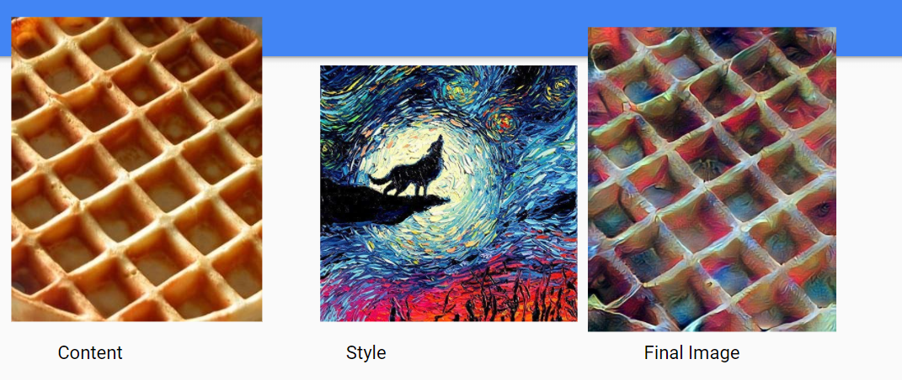
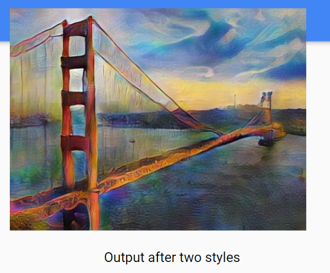

# Neural Style Transfer with Multiple Styles
A python program for extracting essential features from multiple style images and adding them to a single image. Produces an image with multiple styles added to the input image. Made it as the final project for the course Statistical Methods in AI taught by Prof. Ravi Kiran at IIIT - Hyderabad.

# Single Style Transfer Examples

  

&nbsp;

&nbsp;

  

&nbsp;

&nbsp;

# Multi Style Transfer Examples

  
  

&nbsp;

&nbsp;

  
  

&nbsp;

&nbsp;

  
  

&nbsp;

&nbsp;

